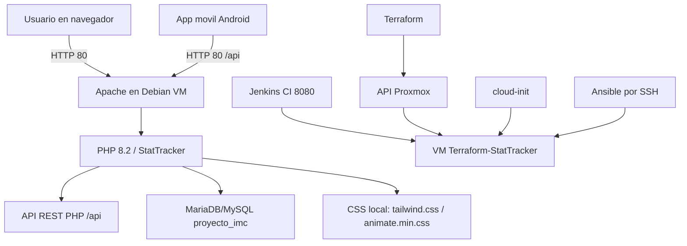

# Arquitectura Y Componentes

## Diagrama General



## Proxmox

Proxmox aloja la VM. Terraform usa el provider `telmate/proxmox` y un token API para crear o modificar recursos.

En el entorno actual, la VM real es:

```text
Nombre: Terraform-StatTracker
VMID: 1247
IP: 192.168.5.34
```

La VM tiene activado el arranque automatico:

```text
onboot = 1
startup = order=1,up=60,down=30
```

## VM Debian

La VM ejecuta Debian y contiene:

- Aplicacion web: `/var/www/stattracker`
- Proyecto IaC: `/home/stattracker/StatTacker_Terraform`
- Apache habilitado al arranque.
- MariaDB habilitado al arranque.
- Terraform instalado.
- Ansible instalado.
- Jenkins instalado y habilitado al arranque.
- Java 21 instalado mediante Temurin.

## Aplicacion Web

Apache apunta su `DocumentRoot` a:

```text
/var/www/stattracker
```

El VirtualHost define las variables de entorno que PHP necesita para conectar con la base de datos:

```apache
SetEnv DB_HOST localhost
SetEnv DB_DATABASE proyecto_imc
SetEnv DB_USERNAME stattracker
SetEnv DB_PASSWORD <valor-local>
```

La contrasena real no debe documentarse ni subirse a GitHub.

## API REST

La API de la aplicacion queda servida por Apache en:

```text
http://192.168.5.34/api
```

Para compatibilidad con clientes que usaban la ruta antigua, tambien funciona:

```text
http://192.168.5.34/proyecto_imc/api
```

Ansible configura `Alias /proyecto_imc` en Apache y parchea el router `api/index.php` para aceptar ambas bases.

## Jenkins

Jenkins queda instalado en la VM como servicio systemd independiente de Apache:

```text
http://192.168.5.34:8080/
```

Usa Java 21 (`temurin-21-jdk`) y el paquete LTS del repositorio oficial de Jenkins. El puerto se controla desde la variable Ansible `jenkins_port`.

## Base De Datos

La base de datos se llama:

```text
proyecto_imc
```

Tablas esperadas:

```text
usuarios
metricas
```

## CSS Local

El problema inicial de "sin CSS" se resolvio generando recursos locales:

```text
/var/www/stattracker/css/tailwind.css
/var/www/stattracker/css/animate.min.css
```

Los PHP ya no deben depender de:

```text
https://cdn.tailwindcss.com
https://cdnjs.cloudflare.com/ajax/libs/animate.css
```

## CSP En LAN

La aplicacion tenia una cabecera CSP que forzaba `upgrade-insecure-requests`. En HTTP por IP privada eso puede hacer que el navegador intente cargar recursos por HTTPS y bloquee estilos/scripts.

Se modifico `src/SecurityHeaders.php` para:

- No forzar `upgrade-insecure-requests` mientras se usa HTTP en LAN.
- Tratar rangos privados `10.x.x.x`, `172.16-31.x.x` y `192.168.x.x` como entorno LAN.
