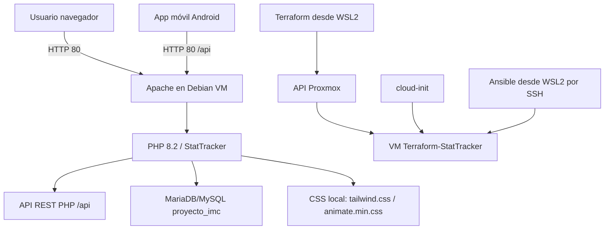

# Memoria del Proyecto: Despliegue de StatTracker en Proxmox con Terraform, Ansible y WSL2

**Autor:** Álvaro Pavón, Manuel Losa Barrios 
**Curso:** 2º CFGS Desarrollo de Aplicaciones Multiplataforma  
**Módulo:** Puesta en Producción Segura  

---

## Índice

1. [Resumen del proyecto](#1-resumen-del-proyecto)
2. [Arquitectura y componentes](#2-arquitectura-y-componentes)
3. [Tecnologías utilizadas](#3-tecnologías-utilizadas)
4. [Entorno de trabajo local: WSL2](#4-entorno-de-trabajo-local-wsl2)
5. [Terraform: automatización de infraestructura en Proxmox](#5-terraform-automatización-de-infraestructura-en-proxmox)
6. [Cloud-init: primera configuración de la VM](#6-cloud-init-primera-configuración-de-la-vm)
7. [Ansible: gestión de configuración idempotente](#7-ansible-gestión-de-configuración-idempotente)
8. [La aplicación StatTracker](#8-la-aplicación-stattracker)
9. [API REST y aplicación móvil](#9-api-rest-y-aplicación-móvil)
10. [Despliegue paso a paso](#10-despliegue-paso-a-paso)
11. [Operación y acceso](#11-operación-y-acceso)
12. [Seguridad y secretos](#12-seguridad-y-secretos)
13. [Troubleshooting](#13-troubleshooting)
14. [Cambios realizados](#14-cambios-realizados)
15. [Conclusiones](#15-conclusiones)

---

## 1. Resumen del proyecto

### 1.1 Objetivo

El objetivo del proyecto es desplegar la aplicación web **StatTracker** (PHP + MySQL) en una máquina virtual Debian dentro de **Proxmox VE**, utilizando **Terraform** para la creación automatizada de la VM, **cloud-init** para la configuración inicial y **Ansible** para la gestión de configuración posterior. Todo el trabajo se realiza desde **WSL2** en Windows, que actúa como máquina de administración.

StatTracker es una aplicación PHP para el seguimiento de estadísticas de salud que utiliza:

- **Apache** como servidor web.
- **PHP 8.2** como runtime.
- **MariaDB/MySQL** como base de datos.
- **Composer** para dependencias PHP.
- **Tailwind CSS** y **Animate.css** generados localmente para evitar depender de CDN externos.

### 1.2 Resultado final

El entorno desplegado queda así:

| Elemento | Descripción |
|----------|-------------|
| Proxmox | Crea y ejecuta la VM automáticamente |
| VM Debian | Arranca automáticamente con el nodo Proxmox |
| Apache | Sirve la web desde `/var/www/stattracker` |
| MariaDB | Base de datos `proyecto_imc` |
| URL web | `http://192.168.5.34/` |
| Acceso SSH | `ssh stattracker@192.168.5.34` |
| VMID | `1247` |

### 1.3 Repositorios implicados

- **Infraestructura (este repositorio):** `https://github.com/AlvaroPavon/StatTacker_Terraform.git`
- **Aplicación PHP:** `https://github.com/AlvaroPavon/StatTracker.git`

El repositorio de infraestructura no contiene el código completo de la aplicación. Lo clona durante el aprovisionamiento mediante cloud-init o Ansible.

---

## 2. Arquitectura y componentes

### 2.1 Diagrama general

```
┌──────────────────────────────────────────────────────────────────┐
│                     PC Windows (WSL2)                             │
│  ┌─────────────────────────────────────────────────────────────┐ │
│  │  WSL2 Debian                                                 │ │
│  │  ├── Terraform CLI ─────→ API Proxmox (crea VM)             │ │
│  │  └── Ansible ───────────→ SSH a VM (configura)              │ │
│  └─────────────────────────────────────────────────────────────┘ │
└────────────────────────────┬─────────────────────────────────────┘
                             │
                             ▼
┌──────────────────────────────────────────────────────────────────┐
│                     Proxmox VE (proxmox4)                         │
│                                                                   │
│  ┌─────────────────────────────────────────────────────────────┐ │
│  │  Template: debian-12-template (VMID 9000)                   │ │
│  │  └── Clonado para crear → VM: stattracker (VMID 1247)       │ │
│  │                                                              │ │
│  │  VM: Terraform-StatTracker                                   │ │
│  │  ├── OS: Debian 12                                           │ │
│  │  ├── IP: 192.168.5.34 (DHCP)                                 │ │
│  │  ├── CPU: 2 cores, RAM: 2 GB, Disco: 20 GB                  │ │
│  │  ├── Servicios: Apache2 + MariaDB                            │ │
│  │  └── Arranque automático: activado                           │ │
│  │                                                              │ │
│  │  Snippet cloud-init: /var/lib/vz/snippets/stattracker-       │ │
│  │                      cloud-init.yml                          │ │
│  └─────────────────────────────────────────────────────────────┘ │
└──────────────────────────────────────────────────────────────────┘
                             │
                             ▼
              ┌─────────────────────────────┐
              │  Usuario navegador          │
              │  http://192.168.5.34/       │
              └─────────────────────────────┘
```

### 2.2 Flujo de interacción



### 2.3 Responsabilidad de cada herramienta

| Herramienta | Responsabilidad |
|-------------|----------------|
| **WSL2** | Entorno Linux de administración desde Windows |
| **Terraform** | Crear y configurar la VM en Proxmox |
| **Cloud-init** | Primera configuración automática de la VM al arrancar |
| **Ansible** | Reaplicar configuración de forma idempotente por SSH |
| **Apache** | Servir la aplicación PHP |
| **MariaDB/MySQL** | Guardar usuarios y métricas de StatTracker |
| **Composer** | Instalar dependencias PHP |
| **Node/NPM** | Generar CSS local con Tailwind y copiar Animate.css |

### 2.4 Proxmox

Proxmox VE aloja la VM. Terraform utiliza el provider `telmate/proxmox` y un token API para crear o modificar recursos. La VM tiene activado el arranque automático:

```text
onboot = 1
startup = order=1,up=60,down=30
```

### 2.5 VM Debian

La VM ejecuta Debian 12 y contiene:

| Ruta | Uso |
|------|-----|
| `/var/www/stattracker` | Aplicación web StatTracker |
| `/home/stattracker/StatTacker_Terraform` | Proyecto IaC dentro de la VM |
| `/var/www/stattracker/css/tailwind.css` | CSS local generado |
| `/var/www/stattracker/css/animate.min.css` | Animate.css local |
| `/etc/apache2/sites-available/stattracker.conf` | VirtualHost Apache |
| `/var/log/apache2/stattracker-error.log` | Log de errores Apache |
| `/var/log/apache2/stattracker-access.log` | Log de accesos Apache |

Servicios habilitados al arranque:

```text
apache2: enabled / active
mariadb: enabled / active
```

---

## 3. Tecnologías utilizadas

### 3.1 WSL2 (Windows Subsystem for Linux 2)

WSL2 es una capa de compatibilidad de Windows que permite ejecutar un kernel Linux completo de forma nativa. Se utiliza como máquina de administración desde la que ejecutar Terraform y Ansible.

| Característica | Detalle |
|----------------|---------|
| Distribución | Debian 13 (trixie) |
| Usuario | `alvaro` (con sudo sin contraseña) |
| Terraform | v1.11.4 |
| Ansible | v12.0.0 (core 2.19.4) |
| Directorio de trabajo | `/home/alvaro/StatTacker_Terraform` |

### 3.2 Terraform

**Versión:** 1.11.4  
**Provider:** `telmate/proxmox` v3.0.2-rc07  

Terraform es una herramienta de Infrastructure as Code (IaC) que permite definir y aprovisionar infraestructura mediante código declarativo. En este proyecto, Terraform gestiona el ciclo de vida completo de la VM en Proxmox.

### 3.3 Cloud-init

**Formato:** cloud-config (YAML)  

Cloud-init es el estándar de la industria para la inicialización de instancias en la nube. Se ejecuta en el primer arranque de la VM y realiza la instalación y configuración inicial del software.

### 3.4 Ansible

**Versión:** 12.0.0 (core 2.19.4)  

Ansible es una herramienta de gestión de configuración que permite aplicar y reparar el estado de la VM por SSH de forma idempotente. Se puede ejecutar múltiples veces y siempre dejará el mismo estado final.

### 3.5 Proxmox VE

**Versión:** 9.0.11  

Proxmox VE es una plataforma de virtualización de servidores empresarial que integra KVM y LXC. Expone una API REST que Terraform consume para gestionar máquinas virtuales.

---

## 4. Entorno de trabajo local: WSL2

### 4.1 ¿Por qué WSL2?

Tradicionalmente, Terraform y Ansible se ejecutan en sistemas Linux. WSL2 permite tener un entorno Linux completo dentro de Windows sin necesidad de máquinas virtuales adicionales ni arranque dual. Esto proporciona:

- Rendimiento nativo de Linux (kernel real)
- Integración total con el sistema de archivos de Windows
- Acceso a herramientas Linux desde PowerShell si es necesario
- Consumo mínimo de recursos

### 4.2 Instalación y configuración de WSL2

#### 4.2.1 Verificar instalación

```powershell
# Comprobar versión de WSL
wsl --status

# Listar distribuciones instaladas
wsl --list --verbose
```

#### 4.2.2 Instalar Debian en WSL2

```powershell
# Instalar Debian
wsl --install -d Debian
```

#### 4.2.3 Configurar usuario y entorno

```bash
# Dentro de WSL Debian (como root), crear usuario:
useradd -m -s /bin/bash -G sudo alvaro
echo 'alvaro:alvaro123' | chpasswd
echo 'alvaro ALL=(ALL) NOPASSWD:ALL' >> /etc/sudoers

# Configurar usuario por defecto para WSL:
echo '[user]' > /etc/wsl.conf
echo 'default=alvaro' >> /etc/wsl.conf
```

#### 4.2.4 Instalar Terraform

```bash
# Descargar e instalar Terraform 1.11.4
cd /tmp
wget https://releases.hashicorp.com/terraform/1.11.4/terraform_1.11.4_linux_amd64.zip
unzip terraform_1.11.4_linux_amd64.zip
mv terraform /usr/local/bin/
chmod +x /usr/local/bin/terraform
terraform --version  # Terraform v1.11.4
```

#### 4.2.5 Instalar Ansible

```bash
# Instalar Ansible desde los repositorios de Debian
apt-get update
apt-get install -y ansible ansible-core sshpass
ansible --version  # ansible 12.0.0
```

#### 4.2.6 Copiar el repositorio a WSL2

```bash
# Desde la unidad C: de Windows montada en /mnt/c
cp -r /mnt/c/Users/alvaro/Desktop/terraform/stattracker-proxmox/StatTacker_Terraform /home/alvaro/
chown -R alvaro:alvaro /home/alvaro/StatTacker_Terraform
```

### 4.3 Acceso a WSL2

```powershell
# Desde PowerShell, abrir WSL con el usuario alvaro
wsl -d Debian --user alvaro

# O simplemente (si Debian es la distribución por defecto)
wsl
```

---

## 5. Terraform: automatización de infraestructura en Proxmox

### 5.1 Estructura de archivos

| Archivo | Función |
|---------|---------|
| `providers.tf` | Declara Terraform y el provider `telmate/proxmox` |
| `main.tf` | Define la VM `proxmox_vm_qemu.stattracker` |
| `variables.tf` | Declara 21 variables configurables |
| `outputs.tf` | Muestra 6 outputs tras el despliegue |
| `terraform.tfvars` | Valores reales del entorno (no se sube a Git) |
| `terraform.tfvars.example` | Plantilla sin secretos |
| `.terraform.lock.hcl` | Lock file con versiones y checksums |

### 5.2 Configuración del provider (providers.tf)

```hcl
terraform {
  required_version = ">= 1.0.0"
  required_providers {
    proxmox = {
      source  = "telmate/proxmox"
      version = "3.0.2-rc07"
    }
  }
}

provider "proxmox" {
  pm_api_url          = var.pm_api_url
  pm_api_token_id     = var.pm_api_token_id
  pm_api_token_secret = var.pm_api_token_secret
  pm_tls_insecure     = true
}
```

La autenticación se realiza mediante **API Token** de Proxmox, no mediante usuario/contraseña, por seguridad. El token se crea desde la interfaz web de Proxmox con:

- **User:** `root@pam`
- **Token ID:** `ciber-apavmar999@pve!ciber-apavmar999`
- **Privilege Separation:** Desmarcado (hereda todos los permisos del usuario)

### 5.3 Definición de la VM (main.tf)

```hcl
resource "proxmox_vm_qemu" "stattracker" {
  name               = var.vm_name
  target_node        = var.pm_node
  agent              = 1            # QEMU Guest Agent
  memory             = var.vm_memory
  scsihw             = "virtio-scsi-single"
  os_type            = "cloud-init"
  clone              = var.pm_template
  vm_state           = "running"
  start_at_node_boot = true         # Arranque automático

  startup_shutdown {
    order            = 1
    startup_delay    = 60
    shutdown_timeout = 30
  }

  # Cloud-init
  ciuser     = var.ci_user
  cipassword = var.ci_password
  cicustom   = "user=local:snippets/stattracker-cloud-init.yml"

  # CPU
  cpu {
    cores   = var.vm_cores
    sockets = 1
    type    = "host"
  }

  # Discos
  disks {
    scsi {
      scsi0 {
        disk {
          storage = var.pm_storage
          size    = var.vm_disk_size
        }
      }
    }
    ide {
      ide1 {
        cloudinit {
          storage = var.pm_storage
        }
      }
    }
  }

  # Red
  network {
    id     = 0
    model  = "virtio"
    bridge = var.pm_bridge
  }
}
```

### 5.4 Variables (variables.tf)

| Variable | Tipo | Default | Descripción |
|----------|------|---------|-------------|
| `pm_api_url` | string | - | URL API Proxmox |
| `pm_api_token_id` | string | - | ID del API Token |
| `pm_api_token_secret` | string (sensitive) | - | Secret del API Token |
| `pm_node` | string | - | Nodo Proxmox |
| `pm_template` | string | - | Template cloud-init |
| `pm_pool` | string | `""` | Pool de recursos |
| `pm_storage` | string | `"local-lvm"` | Storage para discos |
| `pm_bridge` | string | `"vmbr0"` | Bridge de red |
| `vm_name` | string | `"stattracker"` | Nombre de la VM |
| `vm_cores` | number | `2` | CPUs |
| `vm_memory` | number | `2048` | RAM en MB |
| `vm_disk_size` | string | `"20G"` | Tamaño del disco |
| `ci_user` | string | `"stattracker"` | Usuario cloud-init |
| `ci_password` | string (sensitive) | - | Contraseña cloud-init |
| `ssh_key_file` | string | `""` | Clave pública SSH |
| `github_repo` | string | `"https://github.com/AlvaroPavon/StatTracker"` | Repo a clonar |
| `github_branch` | string | `"main"` | Rama a desplegar |
| `db_name` | string | `"proyecto_imc"` | Nombre BD |
| `db_user` | string | `"stattracker"` | Usuario MySQL |
| `db_password` | string (sensitive) | `"Stattracker2025!"` | Contraseña MySQL |
| `db_root_password` | string (sensitive) | `"MySQLRoot2025!"` | Contraseña root MySQL |

### 5.5 Outputs (outputs.tf)

```hcl
output "vm_ip_address" { value = proxmox_vm_qemu.stattracker.default_ipv4_address }
output "vm_name"       { value = proxmox_vm_qemu.stattracker.name }
output "vm_id"         { value = proxmox_vm_qemu.stattracker.vmid }
output "ssh_command"   { value = "ssh ${var.ci_user}@${proxmox_vm_qemu.stattracker.default_ipv4_address}" }
output "app_url"       { value = "http://${proxmox_vm_qemu.stattracker.default_ipv4_address}" }
output "db_connection" { value = { host = "localhost", port = 3306, ... }; sensitive = true }
```

### 5.6 Comandos básicos de Terraform

```bash
# Desde WSL2, en el directorio del proyecto:
cd ~/StatTacker_Terraform

# Inicializar (descarga providers)
terraform init

# Validar sintaxis
terraform validate

# Ver plan de ejecución
terraform plan

# Aplicar cambios (crear/modificar VM)
terraform apply

# Ver outputs
terraform output

# Destruir todo
terraform destroy
```

---

## 6. Cloud-init: primera configuración de la VM

### 6.1 ¿Qué es cloud-init?

Cloud-init es el estándar de facto para la inicialización de instancias en entornos cloud. Se ejecuta automáticamente en el primer arranque de la VM y realiza las tareas definidas en un archivo YAML de tipo `cloud-config`.

### 6.2 Ubicación del snippet

| Entorno | Ruta |
|---------|------|
| Repositorio | `proxmox-snippets/stattracker-cloud-init.yml` |
| Proxmox | `/var/lib/vz/snippets/stattracker-cloud-init.yml` |

### 6.3 Contenido del snippet

El snippet realiza las siguientes operaciones en orden:

1. **Actualiza paquetes** del sistema (`apt update && apt upgrade`).
2. **Instala software:**
   - Apache2
   - PHP 8.2 + extensiones (mysql, mbstring, xml, curl, zip, gd, intl, opcache)
   - libapache2-mod-php8.2
   - MySQL Server
   - Git, Composer, Unzip, NodeJS, NPM
3. **Configura MySQL:**
   - Inicia y habilita el servicio MySQL.
   - Crea la base de datos `proyecto_imc` con charset `utf8mb4`.
   - Crea el usuario `stattracker` con su contraseña.
   - Otorga todos los privilegios sobre `proyecto_imc` al usuario.
4. **Clona el repositorio** de GitHub en `/var/www/stattracker`.
5. **Instala dependencias PHP** con `composer install --no-dev --optimize-autoloader`.
6. **Importa el esquema** de la base de datos desde `database.sql`.
7. **Genera CSS local:**
   - Crea configuración de Tailwind CSS.
   - Ejecuta `npx tailwindcss` para generar `css/tailwind.css`.
   - Copia `animate.min.css`.
   - Reemplaza referencias a CDN en los archivos PHP.
8. **Configura Apache:**
   - Crea VirtualHost en `/etc/apache2/sites-available/stattracker.conf`.
   - Define variables de entorno `DB_HOST`, `DB_DATABASE`, `DB_USERNAME`, `DB_PASSWORD`.
   - Deshabilita el sitio por defecto.
   - Habilita el sitio stattracker.
   - Activa módulos: `rewrite`, `headers`, `expires`, `env`.
9. **Ajusta permisos** de archivos y directorios.
10. **Reinicia Apache** y verifica que responde HTTP 200.

### 6.4 Reejecución

Cloud-init solo se ejecuta en el primer arranque. Si el archivo cambia después, hay dos opciones:

1. **Recrear la VM:**
   ```bash
   terraform apply -replace=proxmox_vm_qemu.stattracker
   ```
2. **Aplicar con Ansible** sobre la VM existente (recomendado).

### 6.5 Logs

```bash
# Dentro de la VM:
cat /var/log/cloud-init.log
cat /var/log/cloud-init-output.log
```

---

## 7. Ansible: gestión de configuración idempotente

### 7.1 ¿Por qué Ansible además de cloud-init?

Cloud-init se ejecuta una sola vez. Si necesitamos modificar la configuración de la VM después del despliegue inicial, Ansible nos permite hacerlo de forma remota por SSH, de manera **idempotente** (se puede ejecutar múltiples veces y siempre deja el mismo estado final).

### 7.2 Estructura de Ansible

```text
ansible/
├── ansible.cfg           # Configuración general
├── inventory.ini         # Inventario de servidores
├── site.yml              # Playbook principal
└── roles/
    └── stattracker/      # Rol de StatTracker
        ├── defaults/main.yml    # Variables por defecto
        ├── handlers/main.yml    # Handlers (restart services)
        ├── tasks/main.yml       # Tareas principales
        └── templates/           # Plantillas (Apache, Tailwind)
```

### 7.3 Inventario

```ini
[stattracker]
stattracker-vm ansible_host=192.168.5.34 ansible_user=stattracker \
  ansible_become=true ansible_become_method=su ansible_become_user=root

[stattracker:vars]
ansible_python_interpreter=/usr/bin/python3
```

Nota: La VM no tiene `sudo`, por lo que se utiliza `become_method = su`.

### 7.4 Configuración (ansible.cfg)

```ini
[defaults]
inventory = inventory.ini
roles_path = roles
host_key_checking = false
interpreter_python = auto_silent

[privilege_escalation]
become = true
become_method = su
become_user = root
```

### 7.5 Tareas del rol stattracker

El rol `stattracker` ejecuta las siguientes tareas en orden:

1. **Actualizar cache APT** (`apt update`).
2. **Instalar paquetes** Debian necesarios.
3. **Asegurar servicios** Apache y MariaDB activos y habilitados.
4. **Crear base de datos y usuario MySQL** si no existen.
5. **Clonar o actualizar** el repositorio de la aplicación.
6. **Ejecutar Composer** para instalar dependencias PHP.
7. **Importar esquema de base de datos** si faltan tablas.
8. **Generar CSS local** con Tailwind (si es necesario reconstruir).
9. **Reemplazar enlaces CDN** por CSS local en los PHP.
10. **Parchear CSP** (`SecurityHeaders.php`) para permitir HTTP en LAN.
11. **Parchear router de la API** (`api/index.php`) para aceptar `/api` y `/proyecto_imc/api`.
12. **Parchear UltimateShield** para permitir checks desde LAN privada.
13. **Configurar VirtualHost Apache** con plantilla.
14. **Habilitar módulos Apache** (rewrite, headers, expires, env).
15. **Limpiar bloqueos temporales** de IPs privadas en `blocked_ips.json`.
16. **Ajustar permisos** de archivos y directorios.
17. **Validar configuración Apache** y recargar.
18. **Verificar** que la web responde HTTP 200 con CSS local y sin errores de BD.
19. **Verificar** que la API responde en ruta canónica (`/api`) y legacy (`/proyecto_imc/api`).

### 7.6 Variables por defecto

```yaml
stattracker_app_dir: /var/www/stattracker
stattracker_repo: https://github.com/AlvaroPavon/StatTracker.git
stattracker_branch: main

stattracker_db_host: localhost
stattracker_db_name: proyecto_imc
stattracker_db_user: stattracker
stattracker_db_password: "{{ lookup('env', 'STATTRACKER_DB_PASSWORD') | default('Stattracker2025!', true) }}"
```

### 7.7 Comandos de Ansible

```bash
# Desde WSL2, en el directorio ansible:
cd ~/StatTacker_Terraform/ansible

# Verificar sintaxis
ansible-playbook site.yml --syntax-check

# Ejecutar playbook (pide contraseñas SSH y root)
ansible-playbook site.yml --ask-pass --ask-become-pass

# Hacer ping a la VM
ansible stattracker -m ping -e ansible_password=<SSH_PASSWORD> -e ansible_become_password=<ROOT_PASSWORD>
```

---

## 8. La aplicación StatTracker

### 8.1 Descripción

StatTracker es una aplicación web de código abierto para el seguimiento de estadísticas de salud (IMC, peso, medidas corporales, etc.). Está desarrollada en PHP 8.2 con un framework MVC propio y utiliza MySQL/MariaDB como base de datos.

### 8.2 Tecnologías de la aplicación

| Tecnología | Uso |
|------------|-----|
| PHP 8.2+ | Lenguaje principal |
| MVC propio | Sin framework externo |
| MySQL/MariaDB | Base de datos `proyecto_imc` |
| Apache + .htaccess | Servidor web |
| Composer | Gestión de dependencias PHP |
| Tailwind CSS | Framework CSS (generado localmente) |
| Animate.css | Animaciones CSS (local) |
| Argon2id | Hash de contraseñas |
| JWT | Autenticación API |
| TOTP | Autenticación de doble factor |

### 8.3 Base de datos

```sql
Base de datos: proyecto_imc
Tablas:
  - usuarios
  - metricas
```

### 8.4 Problema resuelto: CSS sin CDN

Inicialmente, la aplicación cargaba Tailwind CSS y Animate.css desde CDNs externos, lo que provocaba que la web se viera sin estilos si no había conexión a Internet o si el CDN estaba bloqueado. Se solucionó:

1. Generando `css/tailwind.css` localmente mediante `npx tailwindcss`.
2. Copiando `css/animate.min.css` desde `node_modules/animate.css`.
3. Reemplazando las referencias CDN en los archivos PHP.

```php
// Antes (CDN):
<script src="https://cdn.tailwindcss.com?plugins=forms,container-queries"></script>

// Después (local):
<link rel="stylesheet" href="css/tailwind.css"/>
```

### 8.5 CSP (Content Security Policy)

La aplicación tenía una cabecera CSP que forzaba `upgrade-insecure-requests`, lo que hacía que el navegador intentara cargar recursos por HTTPS, bloqueando estilos y scripts al acceder por HTTP en LAN.

Se modificó `src/SecurityHeaders.php` para:
- No forzar `upgrade-insecure-requests` en entorno LAN.
- Tratar rangos privados (`10.x.x.x`, `172.16-31.x.x`, `192.168.x.x`) como entorno LAN.

---

## 9. API REST y aplicación móvil

### 9.1 API REST

StatTracker incluye una API REST PHP dentro del repositorio principal de la aplicación:

```text
/var/www/stattracker/api
```

#### Endpoints principales

| Método | Ruta | Uso |
|--------|------|-----|
| POST | `/api/auth/register` | Registrar usuario |
| POST | `/api/auth/login` | Login y emisión de JWT |
| POST | `/api/auth/logout` | Logout |
| GET | `/api/metrics` | Listar métricas del usuario |
| POST | `/api/metrics` | Crear métrica |
| GET | `/api/metrics/:id` | Ver una métrica |
| PUT | `/api/metrics/:id` | Actualizar métrica |
| DELETE | `/api/metrics/:id` | Eliminar métrica |
| GET | `/api/profile` | Ver perfil y estadísticas |
| PUT | `/api/profile` | Actualizar perfil |
| POST | `/api/profile/password` | Cambiar contraseña |

#### URLs de la API

| Tipo | URL |
|------|-----|
| Canónica | `http://192.168.5.34/api` |
| Legacy | `http://192.168.5.34/proyecto_imc/api` |
| Swagger | `http://192.168.5.34/api/docs/` |

### 9.2 Compatibilidad con ruta legacy

Para mantener la compatibilidad con clientes que usaban la ruta antigua con `proyecto_imc` en la URL:

1. El VirtualHost de Apache define un `Alias /proyecto_imc` hacia el mismo directorio.
2. Ansible parchea `api/index.php` para que el router acepte ambas bases: `/api` y `/proyecto_imc/api`.

### 9.3 Aplicación móvil Android

La app Android está en el repositorio de aplicación:

```text
StatTrackerMobile/
```

La interfaz Retrofit define rutas como:

```kotlin
@POST("api/auth/login")
@GET("api/metrics")
@GET("api/profile")
```

La URL base de Android debe apuntar a la raíz web: `http://192.168.5.34/`

Se implementó `BuildConfig.STATTRACKER_BASE_URL` en lugar de IP fija:

```bash
./gradlew :app:assembleDebug -PstattrackerBaseUrl=http://192.168.5.34/
```

### 9.4 Seguridad de la API

- La API usa JWT en `Authorization: Bearer <token>`.
- CORS permite `Access-Control-Allow-Origin: *` (útil para LAN, restringir en producción).
- Android tiene `usesCleartextTraffic=true` para HTTP en LAN.
- El logging HTTP de la app móvil debe estar activo solo en builds `debug`.

---

## 10. Despliegue paso a paso

### 10.1 Requisitos previos

| Requisito | Descripción |
|-----------|-------------|
| Proxmox VE | Instalado y funcionando en la red |
| Acceso a Proxmox | Para crear templates y API tokens |
| WSL2 | Instalado en Windows con Debian |
| Conexión a internet | La VM necesita descargar paquetes |
| Espacio en disco | Al menos 20 GB libres en Proxmox |

### 10.2 Crear API Token en Proxmox

1. Abrir web de Proxmox: `https://<IP>:8006`
2. Iniciar sesión como `root@pam`
3. Ir a **Datacenter > Permissions > API Tokens > Add**
4. Configurar:
   - **User:** `root@pam`
   - **Token ID:** `terraform`
   - **Privilege Separation:** Desmarcado
5. Copiar el **Token Secret** (solo se muestra una vez)
6. Anotar el Token ID completo: `root@pam!terraform`

### 10.3 Crear template cloud-init en Proxmox

**Opción rápida por consola SSH a Proxmox:**

```bash
# Descargar imagen Debian 12 cloud
wget -O /tmp/debian-12-cloud.qcow2 \
  https://cloud.debian.org/images/cloud/bookworm/latest/debian-12-genericcloud-amd64.qcow2

# Crear VM template
qm create 9000 --name debian-12-template \
  --memory 2048 --cores 2 \
  --net0 virtio,bridge=vmbr0 \
  --scsihw virtio-scsi-pci

# Importar disco
qm importdisk 9000 /tmp/debian-12-cloud.qcow2 local-lvm

# Adjuntar disco
qm set 9000 --scsi0 local-lvm:vm-9000-disk-0

# Crear cloud-init drive
qm set 9000 --ide0 local-lvm:cloudinit

# Configurar boot y consola serial
qm set 9000 --boot order=scsi0
qm set 9000 --serial0 socket
qm set 9000 --vga serial0

# Convertir en template
qm template 9000

# Limpiar
rm /tmp/debian-12-cloud.qcow2
```

### 10.4 Subir snippet cloud-init a Proxmox

```bash
# Desde WSL2, copiar el snippet:
scp /home/alvaro/StatTacker_Terraform/proxmox-snippets/stattracker-cloud-init.yml \
  root@<IP_PROXMOX>:/var/lib/vz/snippets/
```

### 10.5 Configurar Terraform

```bash
# Desde WSL2:
cd ~/StatTacker_Terraform
cp terraform.tfvars.example terraform.tfvars

# Editar con los valores reales:
# - pm_api_url, pm_api_token_id, pm_api_token_secret
# - pm_node, pm_template, ci_password, db_password, db_root_password
nano terraform.tfvars
```

### 10.6 Desplegar la VM

```bash
# Inicializar Terraform
terraform init

# Validar
terraform validate

# Ver plan
terraform plan

# Aplicar (crear la VM)
terraform apply
```

### 10.7 Verificar el despliegue

```bash
# Ver outputs
terraform output
#   app_url = "http://192.168.5.34/"
#   ssh_command = "ssh stattracker@192.168.5.34"

# Acceder a la web
curl -I http://192.168.5.34/
# Debe devolver: HTTP/1.1 200 OK

# Acceder por SSH
ssh stattracker@192.168.5.34
```

### 10.8 Reaplicar configuración con Ansible

```bash
# Desde WSL2:
cd ~/StatTacker_Terraform/ansible
ansible-playbook site.yml --ask-pass --ask-become-pass
```

### 10.9 Comprobación rápida dentro de la VM

```bash
ssh stattracker@192.168.5.34
curl -sS -o /tmp/stattracker.html -w '%{http_code}\n' http://localhost/
# Resultado esperado: 200

grep -c 'Base de datos no disponible' /tmp/stattracker.html
# Resultado esperado: 0

grep -c 'css/tailwind.css' /tmp/stattracker.html
# Resultado esperado: 1
```

---

## 11. Operación y acceso

### 11.1 Acceso web

```text
http://192.168.5.34/
```

### 11.2 Acceso API

```text
Ruta canónica:    http://192.168.5.34/api
Ruta legacy:      http://192.168.5.34/proyecto_imc/api
```

### 11.3 Acceso SSH

```bash
ssh stattracker@192.168.5.34
```

La contraseña se encuentra en `terraform.tfvars` o en la entrega del administrador.

### 11.4 Escalado a root

La VM utiliza `su -`, no `sudo`:

```bash
su -
```

### 11.5 Comprobación de servicios

```bash
# Estado de servicios
systemctl status apache2
systemctl status mysql

# Verificar arranque automático
systemctl is-enabled apache2
systemctl is-enabled mariadb
```

### 11.6 Herramientas instaladas en la VM

```text
Terraform dentro de la VM: v1.15.2
Ansible dentro de la VM:   core 2.14.18
```

### 11.7 Proyecto dentro de la VM

```bash
cd /home/stattracker/StatTacker_Terraform

# Comandos verificados:
terraform validate
cd ansible
ansible-playbook site.yml --syntax-check
```

---

## 12. Seguridad y secretos

### 12.1 Principios aplicados

1. **Nunca subir secretos a Git.**
2. **API Token** en lugar de usuario/contraseña para Terraform.
3. **Contraseñas diferentes** para SSH, MySQL y root de la VM.
4. **Archivos sensibles ignorados** por `.gitignore`.

### 12.2 Archivos que no se suben a Git

```text
terraform.tfvars
terraform.tfstate
terraform.tfstate.backup
.terraform/
*.tfplan
ansible/.vault-pass
ansible/group_vars/*/vault.yml
```

### 12.3 Secretos del proyecto

| Secreto | Dónde se guarda |
|---------|-----------------|
| Token API de Proxmox | `terraform.tfvars` |
| Contraseña usuario VM | `terraform.tfvars` |
| Contraseña SSH | `terraform.tfvars` |
| Contraseña root | `terraform.tfvars` |
| Contraseña MySQL | `terraform.tfvars` |

### 12.4 Recomendaciones de seguridad

- Rotar el token de Proxmox si se ha compartido por error.
- Usar HTTPS si la web se expone fuera de LAN.
- Revisar `git status` antes de hacer commit.
- Usar `ansible-vault` para cifrar contraseñas si se comparte el repositorio.
- No documentar contraseñas en Markdown.

---

## 13. Troubleshooting

### 13.1 La web carga sin CSS

```bash
# Comprobar referencias CSS
curl -s http://localhost/ | grep 'css/tailwind.css'

# Comprobar que Apache sirve el CSS
curl -I http://localhost/css/tailwind.css

# Buscar referencias CDN residuales
grep -RIn 'cdn.tailwindcss.com\|animate.css/4.1.1' /var/www/stattracker/*.php

# Solución: ejecutar Ansible
cd /home/alvaro/StatTacker_Terraform/ansible
ansible-playbook site.yml --ask-pass --ask-become-pass
```

### 13.2 La web dice "Base de datos no disponible"

```bash
# Comprobar variables de entorno en Apache
grep -n 'SetEnv DB' /etc/apache2/sites-available/stattracker.conf

# Comprobar MySQL
mysql -NBe "USE proyecto_imc; SHOW TABLES;"

# Comprobar logs
tail -n 80 /var/www/stattracker/logs/php_errors.log
tail -n 80 /var/log/apache2/stattracker-error.log
```

### 13.3 CSP bloquea recursos en HTTP

Síntoma: El CSS existe, Apache lo sirve como `text/css`, pero el navegador muestra HTML crudo.

```bash
curl -I http://localhost/ | grep -i content-security-policy
```

No debe contener `upgrade-insecure-requests` ni `block-all-mixed-content`.

### 13.4 Terraform no encuentra el snippet

El archivo debe estar en Proxmox en:

```text
/var/lib/vz/snippets/stattracker-cloud-init.yml
```

Verificar con:

```bash
ssh root@<PROXMOX> ls -la /var/lib/vz/snippets/
```

### 13.5 Ansible no conecta

```bash
# Verificar conectividad
ansible stattracker -m ping -e ansible_password=<PASS> -e ansible_become_password=<PASS>
```

Si aparece "world writable directory":

```bash
cd /home/alvaro/StatTacker_Terraform
find . -type d -exec chmod 755 {} \;
find . -type f -exec chmod 644 {} \;
```

### 13.6 La API devuelve 404

```bash
# Probar ruta canónica
curl -i -X POST http://localhost/api/auth/login -H 'Content-Type: application/json' -d '{}'

# Probar ruta legacy
curl -i -X POST http://localhost/proyecto_imc/api/auth/login -H 'Content-Type: application/json' -d '{}'
```

Resultado esperado: `400 Bad Request` (datos vacíos). Si devuelve `Endpoint no encontrado`, ejecutar Ansible.

### 13.7 La web devuelve 403 desde LAN

Causa: UltimateShield detecta herramientas como `curl` y bloquea temporalmente la IP.

```bash
cat /var/www/stattracker/logs/blocked_ips.json
tail -n 40 /var/www/stattracker/logs/security.log
```

El rol Ansible limpia bloqueos de IPs privadas automáticamente.

### 13.8 Problemas de red con WSL2

Si WSL2 no resuelve DNS correctamente:

```bash
# Verificar resolución DNS
nslookup informatica.ieszaidinvergeles.org

# Verificar conectividad con Proxmox
curl -sk -H 'Authorization: PVEAPIToken=<TOKEN>' https://informatica.ieszaidinvergeles.org:8012/api2/json/version
```

---

## 14. Cambios realizados

### 14.1 Correcciones en la VM

- Configurado Apache con variables de entorno `DB_*`.
- Verificada la base de datos `proyecto_imc`.
- Comprobado que las tablas `usuarios` y `metricas` existen.
- Generado `css/tailwind.css` local.
- Copiado `css/animate.min.css` local.
- Reemplazadas referencias CDN en PHP.
- Ajustado CSP para HTTP en IP privada.
- Habilitados servicios al arranque (`apache2`, `mariadb`).
- Activado arranque automático de la VM en Proxmox.

### 14.2 Cambios en Terraform

En `main.tf`:
- Añadido `start_at_node_boot = true`.
- Añadido bloque `startup_shutdown` con orden de arranque.
- Configurado `.terraform.lock.hcl` compatible con Linux.

### 14.3 Cambios en Ansible

Creada la estructura completa `ansible/`:
- Inventario para `192.168.5.34`.
- Configuración con `become_method = su`.
- Rol `stattracker` con 39 tareas.
- Parcheado `SecurityHeaders.php` para CSP en LAN.
- Parcheado `api/index.php` para rutas duales.
- Parcheado `UltimateShield.php` para checks LAN.
- Limpieza de bloqueos temporales en `blocked_ips.json`.

### 14.4 Configuración de WSL2

- Instalado Debian 13 en WSL2.
- Creado usuario `alvaro` con sudo.
- Instalado Terraform 1.11.4.
- Instalado Ansible 12.0.0.
- Copiado repositorio a `/home/alvaro/StatTacker_Terraform`.
- Configurado usuario por defecto en `wsl.conf`.
- Verificada conectividad con Proxmox.

### 14.5 Comprobaciones ejecutadas

```bash
# Desde WSL2:
cd ~/StatTacker_Terraform
terraform init      # OK
terraform validate  # OK
terraform plan      # OK (1 to add)

cd ~/StatTacker_Terraform/ansible
ansible-playbook site.yml --syntax-check  # OK

# Verificar API de Proxmox:
curl -sk -H 'Authorization: PVEAPIToken=...' \
  https://informatica.ieszaidinvergeles.org:8012/api2/json/version
# {"data":{"release":"9.0","version":"9.0.11"}}
```

---

## 15. Conclusiones

### 15.1 Objetivos alcanzados

- [x] Despliegue automatizado de StatTracker en Proxmox.
- [x] Automatización completa con Terraform (creación de VM).
- [x] Configuración inicial con cloud-init.
- [x] Gestión de configuración con Ansible (idempotente).
- [x] Generación local de CSS (sin dependencia de CDN).
- [x] API REST funcional con rutas canónica y legacy.
- [x] Acceso desde aplicación móvil Android.
- [x] Arranque automático de la VM con Proxmox.
- [x] Entorno de administración local con WSL2.
- [x] Documentación completa del proyecto.

### 15.2 Mejoras futuras recomendadas

1. **IP estática configurable** en vez de DHCP.
2. **Certificado SSL** con Let's Encrypt.
3. **Firewall** en la VM (ufw).
4. **Backup automático** de la base de datos.
5. **Monitorización** con health check endpoint.
6. **Docker** como alternativa al despliegue bare-metal.
7. **Separar app y base de datos** en VMs diferentes.
8. **CI/CD** para actualizar la app automáticamente.
9. **Ansible Vault** para cifrar contraseñas en el repositorio.

### 15.3 Dificultades encontradas

1. **CDN de Tailwind no disponible:** La aplicación cargaba CSS desde CDN. Se solucionó generando CSS local.
2. **CSP bloqueando HTTP:** La cabecera `upgrade-insecure-requests` impedía la carga en LAN. Se parcheó el CSP para rangos privados.
3. **API no respondía en ruta canónica:** El router de la API solo aceptaba `/proyecto_imc/api`. Se parcheó para aceptar ambas rutas.
4. **UltimateShield bloqueaba IPs privadas:** El WAF bloqueaba checks de salud desde LAN. Se parcheó para permitir rangos privados.
5. **Errores 451 en repositorios Debian:** El CDN de Debian devolvía errores 451 por HTTP. Se solucionó usando HTTPS en los mirrors.
6. **Autenticación API de Proxmox:** Las peticiones sin token colgaban sin respuesta. Se identificó que era necesario incluir el header de autenticación.

### 15.4 Reflexión personal

Este proyecto ha permitido aplicar los conocimientos adquiridos en el módulo de Puesta en Producción Segura, integrando múltiples tecnologías de automatización y gestión de infraestructura:

- **Infrastructure as Code** con Terraform para la creación de máquinas virtuales.
- **Cloud-init** para la inicialización automatizada de sistemas.
- **Ansible** para la gestión de configuración idempotente.
- **WSL2** como entorno de desarrollo y administración desde Windows.
- **Apache, PHP, MySQL** como stack de servidor web.
- **API REST** para integración con aplicaciones móviles.
- **Seguridad** con JWT, CSP, TOTP y buenas prácticas.

La combinación de estas herramientas permite un despliegue completamente automatizado, reproducible y documentado de una aplicación web en un entorno de virtualización profesional como Proxmox VE.

---

*Álvaro Pavón, Manuel Losa Barrios - 2º CFGS DAM - Puesta en Producción Segura*
