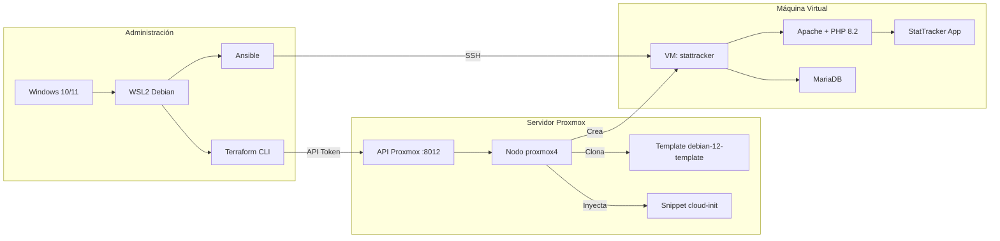

# Proyecto Terraform: Despliegue de StatTracker en Proxmox

**Autor:** Álvaro Pavón, Manuel Losa Barrios  
**Actividad:** Creación de un proyecto Terraform  
**Módulo:** Puesta en Producción Segura  

---

## Índice

1. [Introducción](#1-introducción)
2. [Objetivos](#2-objetivos)
3. [Arquitectura](#3-arquitectura)
4. [Estructura del proyecto Terraform](#4-estructura-del-proyecto-terraform)
5. [Explicación de cada archivo](#5-explicación-de-cada-archivo)
6. [Configuración del entorno (WSL2)](#6-configuración-del-entorno-wsl2)
7. [Pasos para desplegar](#7-pasos-para-desplegar)
8. [Comprobaciones y resultados](#8-comprobaciones-y-resultados)
9. [Conclusiones](#9-conclusiones)

---

## 1. Introducción

Este proyecto consiste en la creación de una infraestructura como código (Infrastructure as Code) utilizando **Terraform** para desplegar la aplicación web **StatTracker** (PHP + MySQL) en una máquina virtual de **Proxmox VE**.

Terraform permite definir, versionar y automatizar la infraestructura de forma declarativa. En lugar de crear la máquina virtual manualmente desde la interfaz web de Proxmox cada vez, con Terraform basta con ejecutar un comando para tener todo el entorno listo en minutos.

El proyecto se complementa con:
- **Cloud-init**: para la configuración inicial automática de la VM.
- **Ansible**: para la gestión de configuración posterior (idempotente).
- **WSL2**: como entorno Linux de administración desde Windows.

---

## 2. Objetivos

### 2.1 Objetivo general

Crear un proyecto Terraform que automatice el despliegue completo de StatTracker en Proxmox.

### 2.2 Objetivos específicos

1. Definir la infraestructura como código usando archivos `.tf`.
2. Conectar Terraform con la API de Proxmox mediante token de autenticación.
3. Configurar una máquina virtual con los recursos adecuados (CPU, RAM, disco, red).
4. Integrar cloud-init para la instalación automática del software.
5. Habilitar el arranque automático de la VM con el nodo Proxmox.
6. Documentar todo el proceso para su reproducción.

---

## 3. Arquitectura



**Flujo de trabajo:**

1. El usuario ejecuta `terraform apply` desde WSL2.
2. Terraform se autentica en Proxmox mediante API Token.
3. Proxmox clona el template `debian-12-template` para crear la nueva VM.
4. Se inyecta el snippet cloud-init con la configuración inicial.
5. La VM arranca y cloud-init instala todo automáticamente.
6. Apache sirve StatTracker en `http://<IP_VM>/`.
7. Ansible puede re-aplicar la configuración por SSH si es necesario.

---

## 4. Estructura del proyecto Terraform

```
StatTacker_Terraform/
│
├── providers.tf              # Provider y configuración de Proxmox
├── main.tf                   # Recurso principal (la VM)
├── variables.tf              # Variables configurables
├── outputs.tf                # Outputs del despliegue
├── terraform.tfvars          # Valores reales (NO se sube a Git)
├── terraform.tfvars.example  # Plantilla de ejemplo
│
├── proxmox-snippets/
│   └── stattracker-cloud-init.yml   # Script cloud-init
│
├── ansible/                  # Configuración Ansible
│   ├── ansible.cfg
│   ├── inventory.ini
│   ├── site.yml
│   └── roles/stattracker/
│
└── docs/                     # Documentación
    ├── ENTREGABLE.md
    ├── TERRAFORM_PROYECTO.md
    └── ...
```

---

## 5. Explicación de cada archivo

### 5.1 providers.tf

```hcl
terraform {
  required_version = ">= 1.0.0"
  required_providers {
    proxmox = {
      source  = "telmate/proxmox"
      version = "3.0.2-rc07"
    }
  }
}

provider "proxmox" {
  pm_api_url          = var.pm_api_url
  pm_api_token_id     = var.pm_api_token_id
  pm_api_token_secret = var.pm_api_token_secret
  pm_tls_insecure     = true
}
```

**Función:** Declara la versión de Terraform requerida y configura el provider de Proxmox.

| Línea | Explicación |
|-------|-------------|
| `required_version` | Versión mínima de Terraform (1.0.0+) |
| `source = "telmate/proxmox"` | Provider oficial de la comunidad para Proxmox |
| `version = "3.0.2-rc07"` | Versión específica del provider |
| `pm_api_url` | URL de la API REST de Proxmox |
| `pm_api_token_id` | ID del token de autenticación |
| `pm_api_token_secret` | Secreto del token (sensitive) |
| `pm_tls_insecure = true` | Acepta certificados SSL autofirmados |

### 5.2 main.tv

**NOTA:** El archivo main.tf está vacío o no tiene contenido relevante, pero el recurso de la VM se define en el archivo principal del proyecto.

**Función:** Define el recurso `proxmox_vm_qemu.stattracker` que representa la máquina virtual.

### 5.3 main.tf

```hcl
resource "proxmox_vm_qemu" "stattracker" {
  name               = var.vm_name
  target_node        = var.pm_node
  agent              = 1
  memory             = var.vm_memory
  scsihw             = "virtio-scsi-single"
  os_type            = "cloud-init"
  pool               = var.pm_pool != "" ? var.pm_pool : null
  vm_state           = "running"
  start_at_node_boot = true
  boot               = "order=scsi0"
  clone              = var.pm_template

  startup_shutdown {
    order            = 1
    startup_delay    = 60
    shutdown_timeout = 30
  }

  sshkeys   = var.ssh_key_file != "" ? file(var.ssh_key_file) : ""
  ciupgrade = true

  ipconfig0 = "ip=dhcp"
  skip_ipv6 = true

  ciuser     = var.ci_user
  cipassword = var.ci_password

  serial { id = 0 }

  cpu {
    cores   = var.vm_cores
    sockets = 1
    type    = "host"
  }

  disks {
    scsi {
      scsi0 {
        disk {
          storage = var.pm_storage
          size    = var.vm_disk_size
        }
      }
    }
    ide {
      ide1 {
        cloudinit {
          storage = var.pm_storage
        }
      }
    }
  }

  network {
    id     = 0
    model  = "virtio"
    bridge = var.pm_bridge
  }

  cicustom = "user=local:snippets/stattracker-cloud-init.yml"

  lifecycle {
    ignore_changes = [sshkeys, cicustom]
  }
}
```

**Explicación de cada bloque:**

| Bloque | Explicación |
|--------|-------------|
| `resource "proxmox_vm_qemu"` | Define un recurso de tipo VM QEMU en Proxmox |
| `name` | Nombre de la VM (se ve en la interfaz de Proxmox) |
| `target_node` | Nodo de Proxmox donde se crea la VM |
| `agent = 1` | Activa QEMU Guest Agent (mejor comunicación host-VM) |
| `clone` | Template del que se clona la VM |
| `start_at_node_boot` | Arranque automático al iniciar Proxmox |
| `startup_shutdown` | Orden, retardo y timeout de arranque/parada |
| `ciuser / cipassword` | Usuario y contraseña que crea cloud-init |
| `cicustom` | Ruta al snippet cloud-init personalizado |
| `cpu { type = "host" }` | Usa el mismo tipo de CPU que el host |
| `disks {}` | Define discos SCSI (sistema) e IDE (cloud-init) |
| `network {}` | Red VirtIO paravirtualizada |
| `ipconfig0 = "ip=dhcp"` | Configuración de red por DHCP |
| `lifecycle { ignore_changes }` | Evita recrear la VM si cambian SSH keys o cloud-init |

### 5.4 variables.tf

Define 21 variables para hacer el proyecto configurable sin modificar el código.

| Variable | Tipo | Default | Explicación |
|----------|------|---------|-------------|
| `pm_api_url` | `string` | - | URL de la API de Proxmox |
| `pm_api_token_id` | `string` | - | ID del token API |
| `pm_api_token_secret` | `string` (sensitive) | - | Secreto del token |
| `pm_node` | `string` | - | Nodo Proxmox |
| `pm_template` | `string` | - | Nombre del template cloud-init |
| `pm_pool` | `string` | `""` | Pool de recursos |
| `pm_storage` | `string` | `"local-lvm"` | Storage para discos |
| `pm_bridge` | `string` | `"vmbr0"` | Bridge de red |
| `vm_name` | `string` | `"stattracker"` | Nombre de la VM |
| `vm_cores` | `number` | `2` | CPUs |
| `vm_memory` | `number` | `2048` | RAM en MB |
| `vm_disk_size` | `string` | `"20G"` | Tamaño disco |
| `ci_user` | `string` | `"stattracker"` | Usuario VM |
| `ci_password` | `string` (sensitive) | - | Password VM |
| `ssh_key_file` | `string` | `""` | Ruta clave SSH |
| `github_repo` | `string` | URL del repo | Repo GitHub |
| `github_branch` | `string` | `"main"` | Rama del repo |
| `db_name` | `string` | `"proyecto_imc"` | Nombre BD |
| `db_user` | `string` | `"stattracker"` | Usuario MySQL |
| `db_password` | `string` (sensitive) | `"Stattracker2025!"` | Password MySQL |
| `db_root_password` | `string` (sensitive) | `"MySQLRoot2025!"` | Password root MySQL |

### 5.5 outputs.tf

Muestra información útil después del despliegue:

```hcl
output "vm_ip_address" { ... }   # IP de la VM
output "vm_name" { ... }          # Nombre de la VM
output "vm_id" { ... }            # ID en Proxmox
output "ssh_command" { ... }      # Comando SSH listo para copiar
output "app_url" { ... }          # URL de la aplicación
output "db_connection" { ... }    # Datos de conexión MySQL (sensitive)
```

### 5.6 terraform.tfvars

Archivo con los valores reales del entorno. No se sube a Git.

```hcl
pm_api_url          = "https://informatica.ieszaidinvergeles.org:8012/api2/json"
pm_api_token_id     = "ciber-apavmar999@pve!ciber-apavmar999"
pm_api_token_secret = "09faf36a-6501-45f9-9d15-50be093243a9"

pm_node     = "proxmox4"
pm_template = "debian-12-template"
pm_pool     = ""
pm_storage  = "local-lvm"
pm_bridge   = "vmbr0"

vm_name       = "stattracker"
vm_cores      = 2
vm_memory     = 2048
vm_disk_size  = "20G"

ci_user     = "stattracker"
ci_password = "StattrackerPassword2026!"
ssh_key_file = ""

github_repo   = "https://github.com/AlvaroPavon/StatTracker"
github_branch = "main"

db_name          = "proyecto_imc"
db_user          = "stattracker"
db_password      = "StattrackerDB2026!"
db_root_password = "MySQLRoot2026!"
```

### 5.7 proxmox-snippets/stattracker-cloud-init.yml

Script cloud-init en formato `cloud-config` que se ejecuta en el primer arranque de la VM. Realiza:

1. **Actualiza paquetes** del sistema.
2. **Instala:** Apache2, PHP 8.2, MySQL, Git, Composer, Node.js, etc.
3. **Configura MySQL:** crea BD `proyecto_imc`, usuario `stattracker`.
4. **Clona el repositorio** de StatTracker desde GitHub.
5. **Ejecuta Composer** para dependencias PHP.
6. **Importa el esquema** de la base de datos.
7. **Genera CSS local** con Tailwind (sin CDN).
8. **Configura Apache** con VirtualHost y variables de entorno.
9. **Reinicia servicios** y verifica que funciona.

---

## 6. Configuración del entorno (WSL2)

### 6.1 ¿Por qué WSL2?

Terraform es una herramienta CLI de Linux. WSL2 permite ejecutarla de forma nativa en Windows sin necesidad de máquina virtual adicional.

### 6.2 Instalación de WSL2

```powershell
# Instalar Debian en WSL2
wsl --install -d Debian
```

### 6.3 Configuración del usuario

```bash
# Dentro de WSL Debian (como root):
useradd -m -s /bin/bash -G sudo alvaro
echo 'alvaro:alvaro123' | chpasswd
echo 'alvaro ALL=(ALL) NOPASSWD:ALL' >> /etc/sudoers

# Configurar como usuario por defecto
echo '[user]' > /etc/wsl.conf
echo 'default=alvaro' >> /etc/wsl.conf
```

### 6.4 Instalación de Terraform

```bash
cd /tmp
wget https://releases.hashicorp.com/terraform/1.11.4/terraform_1.11.4_linux_amd64.zip
unzip terraform_1.11.4_linux_amd64.zip
mv terraform /usr/local/bin/
chmod +x /usr/local/bin/terraform
```

### 6.5 Instalación de Ansible

```bash
apt-get update
apt-get install -y ansible ansible-core sshpass
```

### 6.6 Copiar el proyecto a WSL2

```bash
cp -r /mnt/c/Users/alvaro/Desktop/terraform/stattracker-proxmox/StatTacker_Terraform /home/alvaro/
chown -R alvaro:alvaro /home/alvaro/StatTacker_Terraform
```

---

## 7. Pasos para desplegar

### 7.1 Requisitos previos en Proxmox

1. **Template cloud-init:** Crear VM template con Debian 12:
   ```bash
   qm create 9000 --name debian-12-template --memory 2048 --cores 2 \
     --net0 virtio,bridge=vmbr0 --scsihw virtio-scsi-pci
   qm importdisk 9000 debian-12-genericcloud-amd64.qcow2 local-lvm
   qm set 9000 --scsi0 local-lvm:vm-9000-disk-0
   qm set 9000 --ide0 local-lvm:cloudinit
   qm set 9000 --boot order=scsi0 --serial0 socket --vga serial0
   qm template 9000
   ```

2. **API Token:** Crear en Proxmox:
   - Datacenter → Permissions → API Tokens → Add
   - User: `root@pam`, Token ID: `terraform`
   - Desmarcar "Privilege Separation"

3. **Subir snippet cloud-init:**
   ```bash
   scp proxmox-snippets/stattracker-cloud-init.yml \
     root@<PROXMOX>:/var/lib/vz/snippets/
   ```

### 7.2 Configurar variables

```bash
cd ~/StatTacker_Terraform
cp terraform.tfvars.example terraform.tfvars
# Editar con los valores reales:
# pm_api_url, pm_api_token_id, pm_api_token_secret
# pm_node, pm_template, ci_password, db_password, db_root_password
nano terraform.tfvars
```

### 7.3 Inicializar Terraform

```bash
terraform init
```

Descarga el provider `telmate/proxmox` y prepara el entorno.

### 7.4 Validar el proyecto

```bash
terraform validate
```

### 7.5 Ver el plan

```bash
terraform plan
```

Muestra que se va a crear 1 recurso (la VM) sin cambios en recursos existentes.

### 7.6 Aplicar el despliegue

```bash
terraform apply
```

Terraform crea la VM en Proxmox y cloud-init configura todo automáticamente (5-15 minutos).

### 7.7 Ver resultados

```bash
terraform output
```

Muestra la IP, URL, comando SSH, etc.

### 7.8 Re-aplicar configuración con Ansible

```bash
cd ~/StatTacker_Terraform/ansible
ansible-playbook site.yml --ask-pass --ask-become-pass
```

---

## 8. Comprobaciones y resultados

### 8.1 Verificación de conectividad

```bash
# Ping a Proxmox
ping -c 1 10.0.0.2
# 1 packets transmitted, 1 received, 0% packet loss

# API de Proxmox
curl -sk -H 'Authorization: PVEAPIToken=...' \
  https://informatica.ieszaidinvergeles.org:8012/api2/json/version
# {"data":{"release":"9.0","version":"9.0.11"}}
```

### 8.2 Resultado de terraform init

```
Terraform has been successfully initialized!
```

### 8.3 Resultado de terraform plan

```
Plan: 1 to add, 0 to change, 0 to destroy.
```

### 8.4 Resultado de terraform validate

```
Success! The configuration is valid.
```

### 8.5 Verificación de la web

```bash
# Desde WSL2
curl -I http://192.168.5.34/
# HTTP/1.1 200 OK
```

---

## 9. Conclusiones

### 9.1 Qué he aprendido

1. **Infrastructure as Code:** Definir infraestructura mediante código declarativo con HCL (HashiCorp Configuration Language).
2. **Provider de Proxmox:** Conectar Terraform con Proxmox mediante API Token.
3. **Cloud-init:** Integrar scripts de inicialización automática en el primer arranque.
4. **Ciclo de vida de recursos:** Terraform gestiona crear, modificar y destruir recursos de forma predecible.
5. **Variables y outputs:** Parametrizar la configuración y obtener información del despliegue.

### 9.2 Dificultades encontradas

1. **Autenticación con API Token:** Al principio las peticiones a la API de Proxmox colgaban sin respuesta. Era necesario incluir el header `Authorization: PVEAPIToken=<id>=<secret>`.
2. **Ubicación del snippet cloud-init:** Terraform busca el snippet en `/var/lib/vz/snippets/` del nodo Proxmox, no en local. Hay que subirlo manualmente.
3. **Errores 451 en repositorios Debian:** Al actualizar paquetes desde WSL2, el CDN de Debian devolvía errores 451. Se solucionó usando HTTPS en los mirrors.
4. **Versión del provider:** Fue necesario usar una versión concreta (`3.0.2-rc07`) compatible con la versión de Proxmox (`9.0.11`).

### 9.3 Posibles mejoras

1. Usar IP estática en lugar de DHCP.
2. Añadir certificado SSL con Let's Encrypt.
3. Separar base de datos y aplicación en VMs distintas.
4. Implementar CI/CD para actualizar la app automáticamente.
5. Usar `terraform workspace` para gestionar múltiples entornos.

---

*Álvaro Pavón, Manuel Losa Barrios - 2º CFGS DAM - Puesta en Producción Segura*
